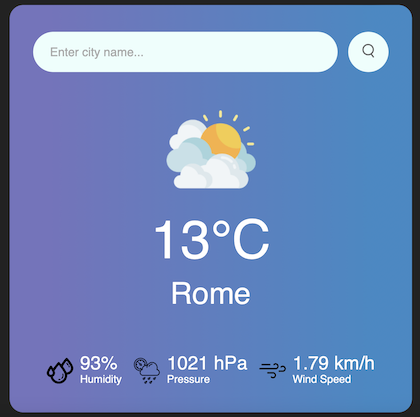
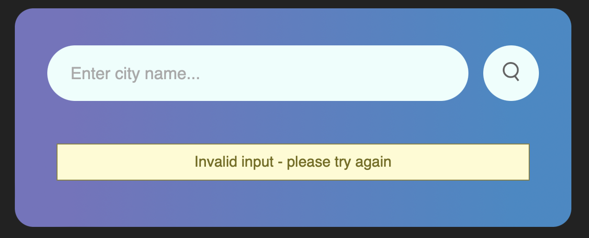

# MyWeather App 🌤

---

### 🌦 Description & functionality:

#### This app allows its users to check the current weather in the city of their choice, providing information such as current temperature, humidity, pressure, wind speed, and sky conditions.

### 🌧 Technologies:
- Backend: Java, Spring, Spring Boot, Spring MVC

- Configuration: Git, Maven, OpenWeatherAPI

- Frontend: HTML/CSS, Thymeleaf

- Tests: JUnit 5, Mockito

### ⚡ How to run this app?

#### 1. Clone this repository:
` https://github.com/patryk47853/MyWeather-App.git `

#### 2. Go to `src/main/resources/application.properties` and add your OpenWeatherAPI key (to create one, visit: `https://openweathermap.org/api`)

#### 3. Run `MyWeatherApplication` class and go to URL `http://localhost:8080/weather` 

---

## ⛄ Running service

#### Home page (search bar)

#### Weather properties

#### Invalid input screen (404 error)

